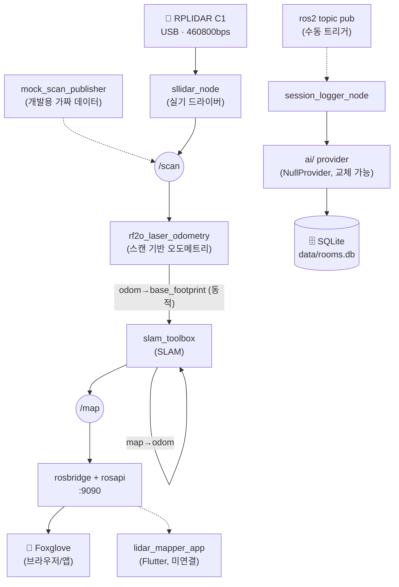

# Portable LiDAR Mapper

> 텀블러형 케이스에 RPLIDAR C1 + Orange Pi 4 Pro를 넣고 들고 다니며 실내 2D 지도(로봇청소기 수준)와 실외 GPS 경로를 기록하는 개인용 프로젝트.

**현재 단계: Phase 1 — PC + 고정 공간에서 SLAM 파라미터 품질 검증 중** (보드 미도착, `docker/` 환경으로 PC에서 선개발).
상세 아키텍처/로드맵은 [`README_ARCHITECTURE.md`](./README_ARCHITECTURE.md), 세션별 작업 기록은 [`devlog/`](./devlog)를 참고.

---

## 개발 단계 (Phase)

| | **Phase 1 (현재)** | **Phase 2 (보드 도착 후)** |
|---|---|---|
| 장소 | PC + **고정된 한 공간** | 실내외 휴대 이동 |
| 목적 | SLAM/오도메트리 파라미터 품질 검증 | 실제 지도 생성 |
| 주 시각화 도구 | RViz2 (정밀 디버깅, `docker/run_dev.sh --rviz`) | Foxglove (폰 원격 접속) |
| 보드 | 없음 (PC로 대체) | Orange Pi 4 Pro 4GB |
| 다음 하드웨어 할 일 | — | 구매 → `hardware/orange_pi_4_pro_bringup_risks.md` 절차대로 이식 |
| Flutter 앱 | 우선순위 낮음 (스캐폴딩만) | 본격 개발 시작 |
| IMU(관성 측정 장치) 추가 | 안 함 (모듈 선정만 완료 — 9축, DFRobot SEN0374 추천) | 실제 장착 + `robot_localization`(EKF) 센서퓨전 연동 |

전환 조건: Orange Pi 4 Pro 구매 + 도착. 상세 이식 절차는 [`hardware/orange_pi_4_pro_bringup_risks.md`](./hardware/orange_pi_4_pro_bringup_risks.md).

**Phase 2는 하드웨어 도착 순서에 맞춰 페이지 0~3으로 더 세분화했습니다** (앱 개발은 rosbridge 프로토콜이 PC/보드 동일해서 오렌지파이 도착을 안 기다리고 지금부터 시작): 페이지0(지금, PC로 앱 선개발) → 페이지1(오렌지파이 도착, 라이다 재부착) → 페이지2(IMU 도착, 센서퓨전+휴대성 테스트) → 페이지3(물리버튼+실사용 필드 테스트+백엔드 구현). 상세는 [`README_ARCHITECTURE.md`](./README_ARCHITECTURE.md) 5.5번.

## 소프트웨어 아키텍처

이 프로젝트는 4가지 설계 원칙 위에 서 있습니다.

1. **레이어드 구조** — 하드웨어 → 드라이버 → ROS2 미들웨어(오도메트리/SLAM) → 데이터
   저장 → 시각화, 5개 계층으로 나뉘고 **계층 간 통신은 오직 ROS2 토픽/메시지로만**
   이루어집니다. 직접 함수를 호출하는 계층 간 결합이 없습니다.
2. **노드 단위 분리(교체 가능성)** — 라이다 드라이버, 오도메트리, SLAM, DB 로깅,
   AI 요약이 각각 독립된 ROS2 노드(프로세스)입니다. 그래서 라이다를
   mock ↔ 실기로, AI 모델을 provider 하나만 바꿔서 교체해도 **다른 코드는 무수정**입니다.
3. **환경 독립성(Docker)** — ROS2/SLAM 전부 Docker 컨테이너 안에서 돌기 때문에,
   호스트가 PC(Ubuntu 20.04)든 나중에 Orange Pi 4 Pro든 **같은 이미지가 그대로
   이식**됩니다. 이게 보드를 라즈베리파이→오렌지파이로 바꿔도 코드 리스크가 적었던
   핵심 이유입니다.
4. **어댑터 패턴** — `ai/`의 `AIProvider` 인터페이스처럼, 하드웨어·모델 종류를
   구체 구현이 아니라 인터페이스로 감싸서 나중에 무엇으로 바뀌어도 갈아끼우기만
   하면 되게 설계합니다.

전체 계층 구조, 각 계층의 책임, ROS2 노드 그래프, 데이터 저장 형식까지의 상세
내용은 [`README_ARCHITECTURE.md`](./README_ARCHITECTURE.md)에 있습니다 — 이 README는
요약이고, 그 문서가 정본입니다.

## 데이터 흐름



실선 = 지금 자동으로 동작 확인된 경로. 점선 = 코드는 있지만 수동 트리거이거나(우측 DB 경로) 아직 연결 전(Flutter 앱).

## 확장 설계 — Flutter 앱 + 데이터 동기화 (2026-09-15, 설계 확정·구현 예정)

Phase 2(보드 도착 후 실사용)를 대비해 앱/백엔드 확장 구조를 설계했습니다. **아직 코드는 없고 설계만 확정된 상태**이며, 상세 내용은 [`README_ARCHITECTURE.md`](./README_ARCHITECTURE.md) 3.5번을 참고하세요.

- **온디맨드 연결 모델**: Orange Pi는 폰 연결 여부와 무관하게 자율로 계속 수집하고, 폰은 배터리 절약을 위해 평소엔 연결을 끊어두다가 확인하고 싶을 때만 붙는 구조.
- **Store-and-Forward(저장 후 전송)**: 오프라인(산속/지하 등)에서도 로컬 SQLite에 항상 먼저 저장하고, 연결되면 자동으로 PC DB에 밀린 데이터를 전송. [다이어그램](https://claude.ai/code/artifact/0686cb80-b7e4-421b-a3e3-a1d0db071f2b)
- **관계형 DB 스키마**: `locations`(장소) + `building_details`/`mountain_details`(장소 종류별 세부정보) + `sessions`(방문 기록)로 실내/실외를 하나의 스키마로 관리. [다이어그램](https://claude.ai/code/artifact/187c3b2d-13b7-421d-bd72-93b475922707)
- **진화형 지도 축적**: 같은 장소를 여러 번 방문해도 slam_toolbox의 `serialize_map`/`deserialize_map`으로 이전 지도에 이어서 매핑 — 재방문 데이터를 중복이 아니라 완성도를 높이는 히스토리로 누적.
- **라이다 한계 극복 전략**: 텀블러+가방 옆주머니 장착 특성상 생기는 가림각·회전오차·도보속도 문제를 `laser_filters`(ROS2 표준 필터 체인) + `robot_localization`(EKF 센서퓨전)으로 대응. [EKF 원리 그림](https://claude.ai/code/artifact/56d51d00-6c3a-4580-b798-53d9f7a12807)

## 빠른 시작 (Docker)

```bash
# 최초 1회: 이미지 빌드
./docker/run_dev.sh --build

# mock 데이터로 파이프라인만 검증 (라이다 없이도 가능)
./docker/run_dev.sh
ros2 launch lidar_mapper_bringup bringup.launch.py use_mock:=true

# 실제 RPLIDAR C1 연결 시
./docker/run_dev.sh --with-lidar
ros2 launch lidar_mapper_bringup bringup.launch.py use_mock:=false lidar_serial_port:=/dev/ttyUSB1

# 고정 공간 정밀 디버깅용 RViz2 (PC 전용, X11 필요)
./docker/run_dev.sh --with-lidar --rviz
```

시각화는 `ws://localhost:9090`으로 [Foxglove](https://studio.foxglove.dev)에 접속하거나, 위 `--rviz` 옵션으로 RViz2를 띄우면 됩니다. 자세한 사용법은 [`docker/README.md`](./docker/README.md).

## 하드웨어

| 부품 | 내용 |
|---|---|
| 센서 | RPLIDAR C1 |
| 보드 | Orange Pi 4 Pro 4GB (Allwinner A733) — **구매 완료(배송 중, 2026-09-11)**, 상세는 [`hardware/board_price_tracking.md`](./hardware/board_price_tracking.md) |
| 폼팩터 | 텀블러형 케이스, 백팩 측면 휴대 |

## 저장소 구조

| 경로 | 내용 |
|---|---|
| `src/` | ROS2 워크스페이스 — `lidar_mapper_bringup`(launch 통합), `lidar_mapper_mock`(가짜 /scan), `lidar_mapper_db`(세션 로깅) |
| `ai/` | AI provider 어댑터 (`AIProvider` 인터페이스 + `NullProvider`, provider 이름만 바꾸면 모델 교체) |
| `app/lidar_mapper_app/` | Flutter 모바일 뷰어 (스캐폴딩, 아직 rosbridge 미연결) |
| `docker/` | 개발 환경 (Dockerfile, `run_dev.sh`, RViz2/Foxglove 가이드) |
| `config/` | slam_toolbox 파라미터, RViz2 기본 레이아웃 |
| `hardware/` | 텀블러 마운트 설계, 보드 가격/스펙 비교·리스크 조사 |
| `devlog/` | 세션별 개발 로그 (매 세션 시작 시 최신 로그부터 읽을 것) |
| `data/` `maps/` `bags/` | 런타임 산출물 (SQLite, 지도 파일, rosbag) |

## 문서 갱신 원칙

이 README와 `README_ARCHITECTURE.md`는 프로젝트의 첫 화면이자 최신 상태를 보여주는 문서입니다.
**구조가 바뀌거나(새 패키지/폴더), 하드웨어 결정이 바뀌거나, 개발 단계(Phase)가 넘어갈 때마다 반드시 갱신**합니다.
다이어그램은 Mermaid로 관리해서(이미지 파일 대신) 코드처럼 diff로 리뷰하고 계속 최신 상태를 유지합니다.
