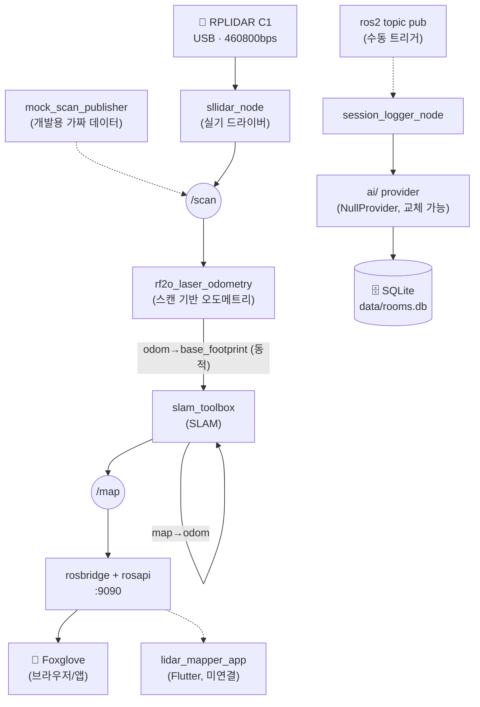

# Portable LiDAR Mapper

> 텀블러형 케이스에 RPLIDAR C1 + Orange Pi 4 Pro를 넣고 들고 다니며 실내 2D 지도(로봇청소기 수준)와 실외 GPS 경로를 기록하는 개인용 프로젝트.

**현재 단계: Phase 1 — PC + 고정 공간에서 SLAM 파라미터 품질 검증 중** (보드 미도착, `docker/` 환경으로 PC에서 선개발).
상세 아키텍처/로드맵은 [`README_ARCHITECTURE.md`](./README_ARCHITECTURE.md), 세션별 작업 기록은 [`devlog/`](./devlog)를 참고.

---

## 데이터 흐름



실선 = 지금 자동으로 동작 확인된 경로. 점선 = 코드는 있지만 수동 트리거이거나(우측 DB 경로) 아직 연결 전(Flutter 앱).

## 빠른 시작 (Docker)

```bash
# 최초 1회: 이미지 빌드
./docker/run_dev.sh --build

# mock 데이터로 파이프라인만 검증 (라이다 없이도 가능)
./docker/run_dev.sh
ros2 launch lidar_mapper_bringup bringup.launch.py use_mock:=true

# 실제 RPLIDAR C1 연결 시
./docker/run_dev.sh --with-lidar
ros2 launch lidar_mapper_bringup bringup.launch.py use_mock:=false lidar_serial_port:=/dev/ttyUSB1

# 고정 공간 정밀 디버깅용 RViz2 (PC 전용, X11 필요)
./docker/run_dev.sh --with-lidar --rviz
```

시각화는 `ws://localhost:9090`으로 [Foxglove](https://studio.foxglove.dev)에 접속하거나, 위 `--rviz` 옵션으로 RViz2를 띄우면 됩니다. 자세한 사용법은 [`docker/README.md`](./docker/README.md).

## 하드웨어

| 부품 | 내용 |
|---|---|
| 센서 | RPLIDAR C1 |
| 보드 | Orange Pi 4 Pro 4GB (Allwinner A733) — 구매 전, 상세는 [`hardware/board_price_tracking.md`](./hardware/board_price_tracking.md) |
| 폼팩터 | 텀블러형 케이스, 백팩 측면 휴대 |

## 저장소 구조

| 경로 | 내용 |
|---|---|
| `src/` | ROS2 워크스페이스 — `lidar_mapper_bringup`(launch 통합), `lidar_mapper_mock`(가짜 /scan), `lidar_mapper_db`(세션 로깅) |
| `ai/` | AI provider 어댑터 (`AIProvider` 인터페이스 + `NullProvider`, provider 이름만 바꾸면 모델 교체) |
| `app/lidar_mapper_app/` | Flutter 모바일 뷰어 (스캐폴딩, 아직 rosbridge 미연결) |
| `docker/` | 개발 환경 (Dockerfile, `run_dev.sh`, RViz2/Foxglove 가이드) |
| `config/` | slam_toolbox 파라미터, RViz2 기본 레이아웃 |
| `hardware/` | 텀블러 마운트 설계, 보드 가격/스펙 비교·리스크 조사 |
| `devlog/` | 세션별 개발 로그 (매 세션 시작 시 최신 로그부터 읽을 것) |
| `data/` `maps/` `bags/` | 런타임 산출물 (SQLite, 지도 파일, rosbag) |

## 문서 갱신 원칙

이 README와 `README_ARCHITECTURE.md`는 프로젝트의 첫 화면이자 최신 상태를 보여주는 문서입니다.
**구조가 바뀌거나(새 패키지/폴더), 하드웨어 결정이 바뀌거나, 개발 단계(Phase)가 넘어갈 때마다 반드시 갱신**합니다.
다이어그램은 Mermaid로 관리해서(이미지 파일 대신) 코드처럼 diff로 리뷰하고 계속 최신 상태를 유지합니다.
